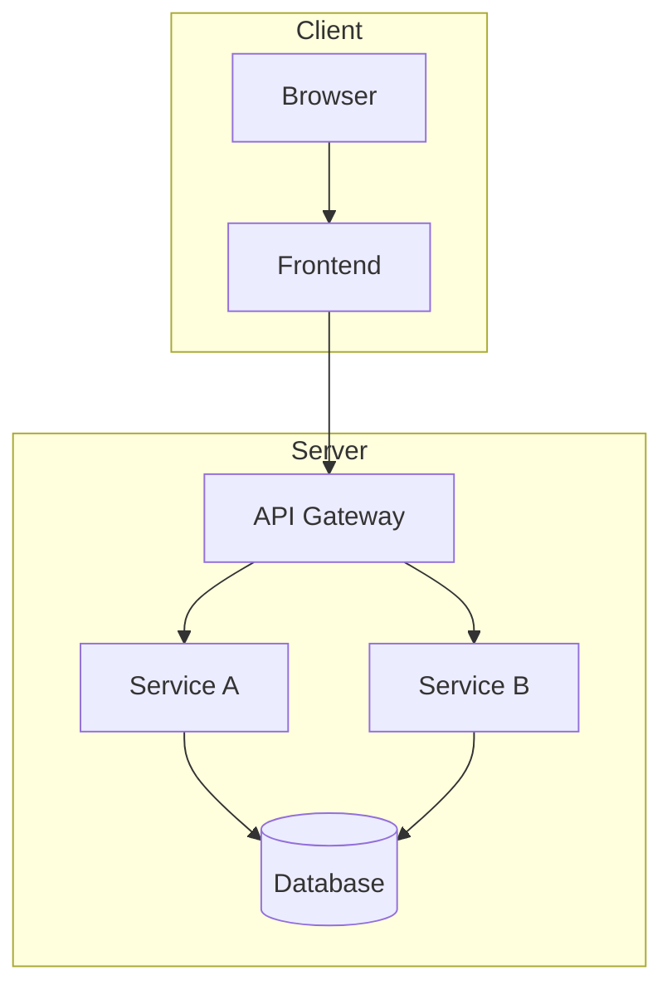

# {{title}}

```mermaid
graph TB
    subgraph Client
        A[Browser] --> B[Frontend]
    end

    subgraph Server
        C[API Gateway] --> D[Service A]
        C --> E[Service B]
        D --> F[(Database)]
        E --> F
    end

    B --> C
```

Key components:
- **Frontend**: Handles user interaction
- **API Gateway**: Routes and validates requests
- **Services**: Business logic layer
