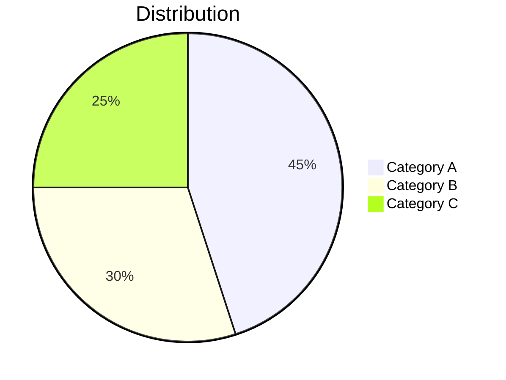

# {{title}}

::left::

## Key Findings

1. **Finding 1**: Brief description with statistical significance (p < 0.05)

2. **Finding 2**: Brief description with effect size (d = X.XX)

3. **Finding 3**: Brief description with confidence interval [X, Y]

::right::

*Note: All results significant at alpha = 0.05 unless otherwise noted*
